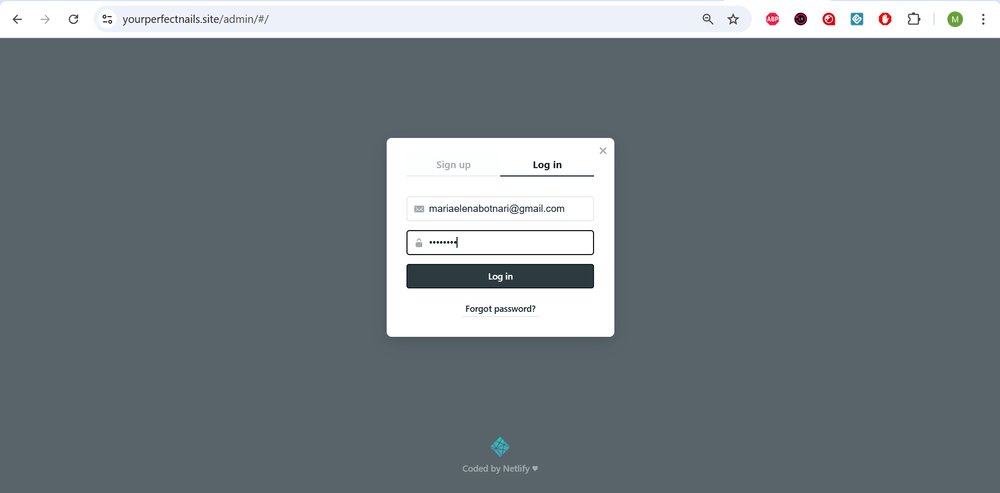
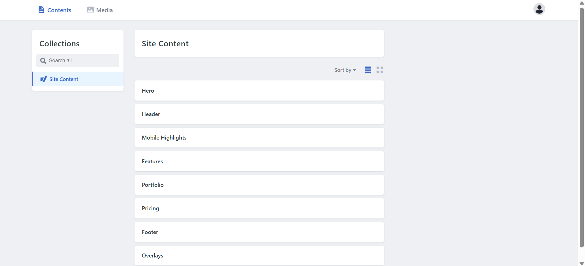
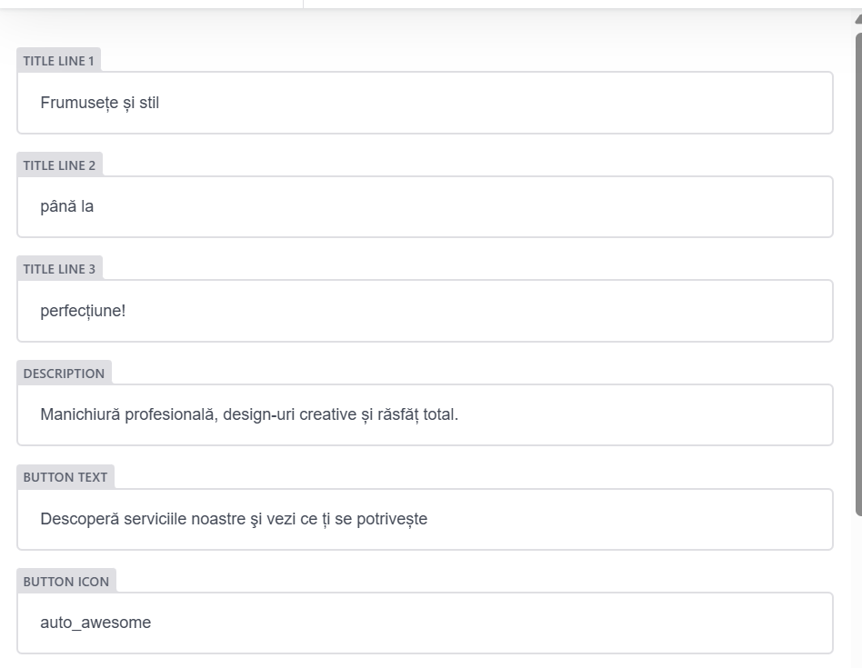
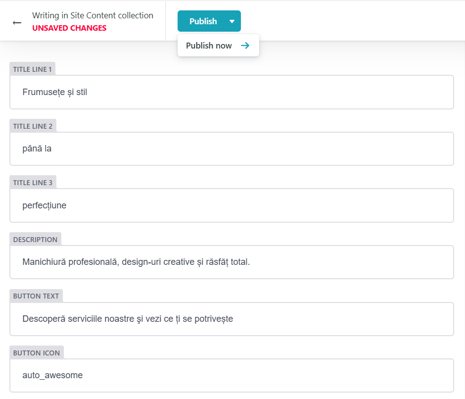
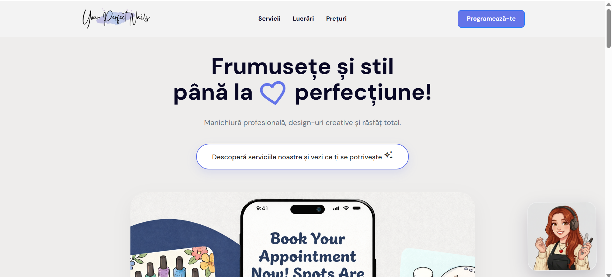
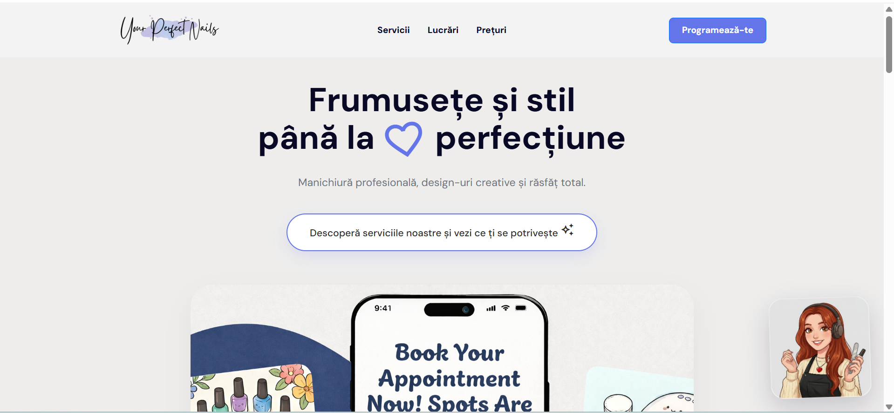

# Laboratory Work 4

## 1. Introduction

This laboratory work focused on improving a static landing page by introducing a modern development workflow based on a static site framework, a Git-based content management system (CMS), and automated deployment.

The goal was to transform a traditional static website where all content was embedded directly in HTML files into a more maintainable architecture where the content is stored separately and can be edited through a CMS interface.

The final result allows content updates without modifying the source code, while still keeping the performance benefits of a static website.

---

## 2. Migration to a Static Site Framework

Initially, the website consisted of static HTML, CSS, and JavaScript files where the content and layout were tightly coupled. This structure made maintenance difficult because any change to the content required editing HTML files manually.

To improve maintainability, the project was migrated to the **Astro static site framework**. Astro allows developers to organize websites using reusable components and generates optimized static pages during the build process.

During the migration process, the existing HTML layout was reorganized into components and pages inside the Astro project. This allowed the separation of concerns between the visual layout and the website content.

The migration process included the following steps:

- creating a new Astro project
- moving the existing HTML layout into Astro components
- reorganizing the code into reusable sections
- preparing the project for content-driven architecture

Astro was chosen because it allows fast static builds, component-based architecture, and easy integration with external tools such as content management systems.

---

## 3. Content Extraction

After migrating the layout into the framework, the next step was separating the content from the presentation layer.

Originally, the content such as titles, descriptions, service lists, and navigation items were written directly inside the HTML components. This was replaced with a structured approach where all editable content was moved into JSON files.

Each major section of the website was assigned its own content file. Examples of extracted content include:

- hero section text
- navigation elements
- service descriptions
- portfolio images
- pricing information
- footer content

This approach allows the layout components to dynamically load their content from structured files instead of containing hardcoded values.

Separating the content from the layout also makes it possible for a CMS to modify the data without affecting the website structure.

---

## 4. Git-Based CMS Integration

To allow content editing without modifying the codebase, a **Git-based CMS (Decap CMS)** was integrated into the project.

Decap CMS provides an administrative interface that allows users to edit content stored in the repository. When a user modifies content through the CMS interface, the CMS automatically updates the corresponding files and commits the changes to the Git repository.

The CMS interface was added to the project inside the public directory so that it can be accessed from the deployed website.

The CMS configuration defines the editable content collections and maps them to the corresponding JSON files used by the website.

Through this configuration, the CMS allows editing of various sections of the website such as:

- hero section text and image
- navigation menu
- features and services
- portfolio gallery
- pricing information
- footer content
- overlay elements

Each editable field in the CMS corresponds to a structured field inside the JSON content files.

---

## 5. CMS Authentication and Access

To protect the CMS interface, authentication was configured using the hosting platform's identity service.

Only authorized users can access the CMS dashboard and edit website content. After authentication, the user can access the CMS interface through the `/admin` route of the deployed website.

The authentication system ensures that only approved users are able to modify the content while the public website remains accessible to all visitors.

---

## 6. Content Editing Workflow

The CMS provides a graphical interface where content can be edited through form inputs rather than directly editing code.

When a user updates content in the CMS:

1. The CMS modifies the corresponding JSON content file.
2. The change is committed to the Git repository.
3. The hosting platform detects the repository update.
4. A new build is triggered automatically.
5. The updated website is deployed.

This workflow ensures that all content changes follow a version-controlled process.

---

## 7. Deployment

The project is deployed using **Netlify**, which provides automated deployment directly from the Git repository.

The deployment process works as follows:

1. Code is pushed to the repository.
2. Netlify detects the changes.
3. The Astro project is built.
4. Static files are generated.
5. The website is deployed to the Netlify CDN.

This allows the website to be updated automatically whenever content is modified through the CMS or when code changes are pushed to the repository.

---

## 8. Custom Domain Configuration

A custom domain was connected to the deployed website in order to make the website accessible through a professional URL.

The domain configuration involved:

- adding the domain to the hosting platform
- configuring DNS records through the domain registrar
- verifying domain ownership
- generating an SSL certificate for secure HTTPS connections

After the DNS configuration was completed and verified, a Let's Encrypt SSL certificate was automatically generated and installed.

The website is now accessible securely through the custom domain using HTTPS.

---

## 9. Proof of CMS Content Editing

The following screenshots demonstrate how content was modified through the CMS interface and how the changes appeared on the deployed website.

---

### CMS Dashboard

Logging in:

Dashboard:

---

### Editing Website Content

Modifying hero section:

---

### Updated Content Reflected in the Deployed Website

Landing page before any changes made:

Landing page after changes made:

## Live Demo

The deployed website can be accessed at the following link:

[https://yourperfectnails.site](https://yourperfectnails.site/)

